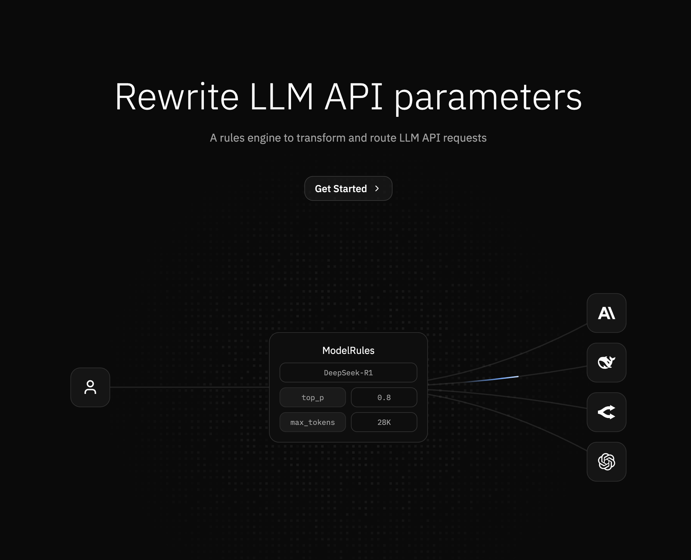

<p align="center">
  <a href="" target="_blank">
  
  </a>
</p>

<h1 align="center">Modelrules</h1>

<p align="center">
    The open-source rules engine for LLM APIs.
    <br />
    <a href="#features"><strong>Explore Features »</strong></a>
    <br />
    <br />
    <a href="https://rules.exectx.run">Getting Started</a>
    ·
    <a href="./apps/rules/README.md#deployment">Deployment</a>
    ·
    <a href="#contributing">Contributing</a>
    ·
    <a href="https://github.com/exectx/model-rules/issues">Issues</a>
</p>

<p align="center">
   <a href="https://github.com/exectx/model-rules/stargazers"></a>
   <a href="https://github.com/exectx/model-rules/blob/main/LICENSE"></a>
</p>



## About The Project

Modelrules is a rules engine for LLM APIs. It provides a simple way to override any API parameters for OpenAI-compatible LLM providers. It's ideal for environments where LLM clients are constrained to specific parameters or can't offer flexible customization.

All configuration rules are applied server-side, and you can securely store your LLM provider credentials.

## ✨ Features

- **⚙️ Customizable Rules**: Create custom rules to overwrite your LLM API parameters and apply them per model or provider.
- **🔒 Secure Credential Storage**: Securely store provider API keys and credentials.
- **🔑 Virtual API Key Management**: Create, manage, and revoke virtual API keys for your applications.
- **🔄 OpenAI-Compatible**: Drop-in replacement for any OpenAI-compatible API.
- **🚀 Built with Modern Tech**: Server-side rendering with React Router, Vite for fast development, and TailwindCSS for styling.

## A Note on OpenAI Compatibility

While Modelrules is designed to be a drop-in replacement in your OpenAI SDK client by changing the `baseURL`, it's important to understand how compatibility works. Modelrules acts as a proxy, forwarding requests to the upstream LLM provider you configure in your rulesets.

The actual OpenAI API compatibility depends entirely on the provider you are routing to:

- **Guaranteed Compatibility**: If your ruleset points to an OpenAI model, you'll have full compatibility.
- **Provider-Dependent Compatibility**: If you're using a different provider like Anthropic, you must use their OpenAI-compatible endpoint for the `baseURL` in your ruleset.
- **Runtime Errors**: If you configure a ruleset with a `baseURL` that is not OpenAI-compatible and then try to use it with an OpenAI SDK (e.g., `openai.chat.completions.create`), you will encounter runtime errors because the request and response formats will not match what the SDK expects.

In short, Modelrules doesn't translate between different API schemas; it enriches requests and routes them. The provider's endpoint specified in your rule must be compatible with the SDK you are using on the client-side.

## Built With

### Frontend

- [React](https://reactjs.org/)
- [React Router](https://reactrouter.com/)
- [Vite](https://vitejs.dev/)
- [TypeScript](https://www.typescriptlang.org/)
- [Tailwind CSS](https://tailwindcss.com/)
- [Radix UI](https://www.radix-ui.com/)

### Backend & Database

- [Hono](https://hono.dev/)
- [Cloudflare Workers](https://workers.cloudflare.com/)
- [Drizzle ORM](https://orm.drizzle.team/)
- [Turso](https://turso.tech/) (SQLite)
- [Clerk](https://clerk.com/) for Authentication
- [Cloudflare KV](https://developers.cloudflare.com/kv/) for Caching

## How it Works

1.  **Create a Virtual API Key**: Generate a new API key within the Modelrules application.
2.  **Define a Ruleset**: Create a ruleset for a specific LLM provider or model. In the ruleset, you can override API parameters (like `temperature`, `top_p`, etc.) and securely provide the credentials for the target LLM provider.
3.  **Make a Request**: Send a request to the Modelrules API as you would to the OpenAI API. To specify which ruleset to use, prepend its name and two colons to the model name. For example, with a ruleset named "my-ruleset" and the "gpt-3.5-turbo" model, set the model to `"my-ruleset::gpt-3.5-turbo"`.

## Example Usage

Here's how you can make a request:

### cURL

```bash
curl -X POST https://rules.exectx.run/api/chat/completions \
-H "Authorization: Bearer $RULES_API_KEY" \
-H "Content-Type: application/json" \
-d '{
  "model": "my-ruleset::o4-mini",
  "messages": [{
    "role": "user",
    "content": "What is the capital of France?"
  }]
}'
```

## Local Development

For detailed instructions on how to run the project locally, please see the [local development guide](./apps/rules/README.md#local-development).

## Contributing

Contributions are what make the open source community such an amazing place to learn, inspire, and create. Any contributions you make are **greatly appreciated**.

1.  Fork the Project
2.  Create your Feature Branch (`git checkout -b feature/AmazingFeature`)
3.  Commit your Changes (`git commit -m 'Add some AmazingFeature'`)
4.  Push to the Branch (`git push origin feature/AmazingFeature`)
5.  Open a Pull Request

## License

Distributed under the MIT License.

## Acknowledgments

- [Vercel](https://vercel.com) for the inspiration on README design.
- [Cloudflare](https://www.cloudflare.com/) for the powerful serverless platform.
- All the open-source libraries that made this project possible.
